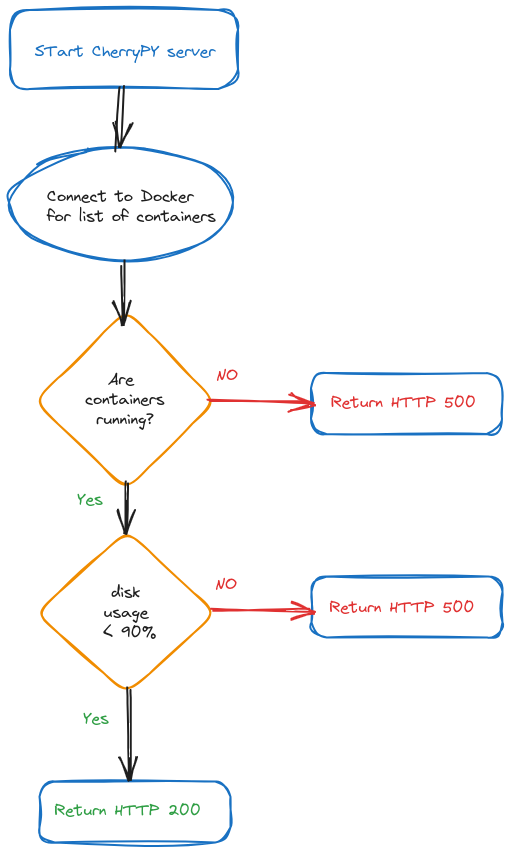

# dockercheck - check and expose containers health

dockrcheck is an HTTP server that serves a `/health` endpoint for the targetgroup. It also exposes a Prometheus client with the statuses of the containers.

`dockercheck` inspects all the running containers on the system, looking for containers labelled with `com.docker.compose.project` (default value, can be adjusted via an environment variable).
It will check disk usage and the health of the containers and then return the proper HTTP status on the `/health` endpoint.

## Prometheus client

At the same time, `dockercheck` exposes a Prometheus clients with the statuses of all the containers matching the label. It exports a single metric (controlled by `DOCKERCHECK_PROM_METRIC`) with two labels attached:

* container `name`
* container `role`

 on the `/metrics` path. The metrics get updated everytime the `/health` endpoint is accessed (sorry, no dedicated updating thread atm `¯\_(ツ)_/¯`).

## Configuration parameters

The program is customizable via environment variables

|ENV VAR |Default value |Meaning|
|-|-|-|
|DOCKERCHECK_HTTP_PORT|8080|Port used for the healthcheck status|
|DOCKERCHECK_LABEL|"com.docker.compose.project"|Label used to filter containers. It can be just a label name or label=value|
|DOCKERCHECK_PROM_METRIC|"container_status"|The name of the metric exposed by the Prometheus client|
|DISK_USAGE_THRESHOLD|-1|The threshold for the disk usage|

## Makefile

The Makefile included in this repository provides several targets to automate common tasks related to setting up and running the `dockercheck` application.

### Targets

- **venv**: Creates a virtual environment, installs dependencies listed in `requirements.txt`.
- **run-and-start-containers**: Starts Docker containers using `docker-compose up -d` and then runs the `dockercheck` application.
- **test-health**: Hits the `/health` endpoint of the running application using `curl`.
- **stop-containers**: Stops Docker containers using `docker-compose down`.
- **clean**: Deletes the virtual environment.

### Example Usage

To set up the environment and run the `dockercheck` application, you can use the following commands:

```bash
make run-and-start-containers
```
For testing the health of the application:
```bash
make test-health
```

## Health calculation logic


